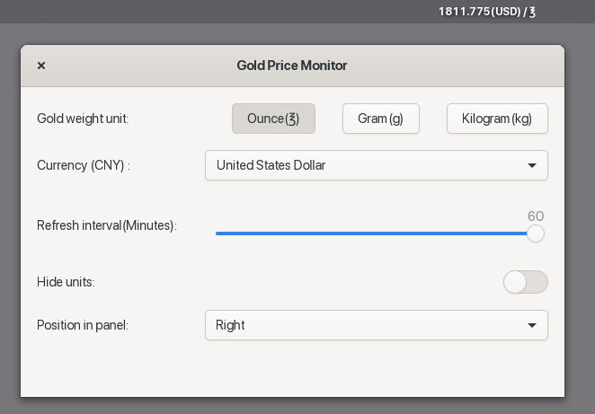

Gold Price Monitor
==================

 

A GNOME Shell extension that allows you to track precious metals (Gold & Silver) prices in real-time directly from your top panel.

### Supported Metals
- **Gold (XAU)**
- **Silver (XAG)**
*(Can be enabled individually or displayed simultaneously)*

### Supported Providers
- [GOLDPRICE](https://goldprice.org/) (no API key required)
- [gold-api.com](https://gold-api.com/) (no API key required)
- [goldapi.io](https://www.goldapi.io/) (requires free API key)

## ScreenShot

## Installation

1. `make install`
2. Gnome Extensions [Gold Price Monitor](https://extensions.gnome.org/extension/2075/gold-price-monitor/)
3. download from [Release](https://github.com/wotmshuaisi/goldpricemonitor/releases), extract zip file into `~/.local/share/gnome-shell/extension/`, `alt`+`f2`input`r` restart gnome shell

## References

> [Step by step tutorial to create extensions](https://wiki.gnome.org/Projects/GnomeShell/Extensions/StepByStepTutorial)

> [dmo60/CoverflowAltTab](https://github.com/dmo60/CoverflowAltTab)

## LICENSE

