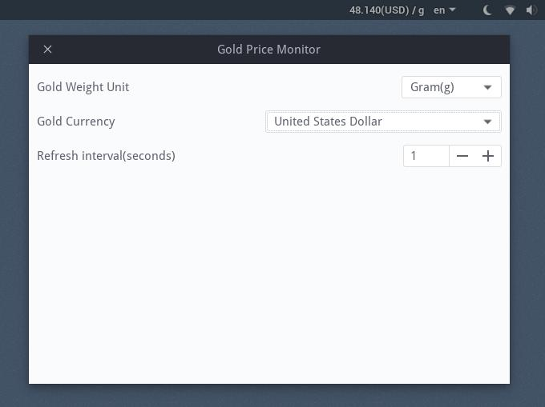

Gold Price Monitor
==================

 

simple gnome extension helps you tracking gold price in realtime

## ScreenShot

## Installation

1. `make install`
2. Gnome Extensions (waiting for approval...)

## References

> [Step by step tutorial to create extensions](https://wiki.gnome.org/Projects/GnomeShell/Extensions/StepByStepTutorial)

> [dmo60/CoverflowAltTab](https://github.com/dmo60/CoverflowAltTab)

## LICENSE

